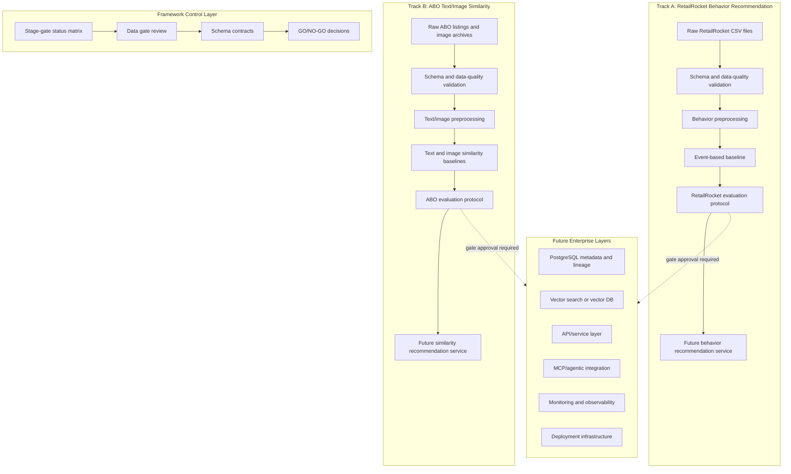

# Final Enterprise Architecture Target

## Purpose

This document defines the final enterprise architecture target for the Enterprise Multimodal E-Commerce Recommendation AI System. It is a control-layer reference for future implementation decisions, not a claim that all listed layers already exist.

The project currently remains a local, portfolio-level AI/ML engineering system focused on evidence-based development. Advanced production layers must be introduced only after the data gate, schema contracts, baseline evidence, and evaluation protocols are strong enough to support them.

## Final Target System Vision

The final target is an enterprise-style recommendation platform with two independent recommendation tracks:

1. RetailRocket behavior recommendation.
2. Amazon Berkeley Objects product text and image similarity recommendation.

The system should eventually support validated data ingestion, reproducible preprocessing, baseline and advanced recommendation methods, evaluation gates, service interfaces, retrieval infrastructure, observability, and deployment controls.

The final system must preserve dataset provenance. RetailRocket and ABO are independent real-world dataset tracks and must not be merged into a single catalog, user graph, or business entity model.

## Two-Track Architecture

### Track A: RetailRocket Behavior Recommendation

RetailRocket is used for behavior and event-based recommendation. Its raw files are expected under `data/raw/RetailRocket_event-based/` and include:

- `events.csv`
- `item_properties_part1.csv`
- `item_properties_part2.csv`
- `category_tree.csv`

The recommendation task is behavior-based and may use views, add-to-cart events, and transactions under a separately approved evaluation protocol.

### Track B: Amazon Berkeley Objects Text/Image Similarity

Amazon Berkeley Objects is used for product metadata, product text similarity, and product image similarity. Its raw files are expected under `data/raw/amazon_berkeley_text_images-based/` and include:

- `abo-listings.tar`
- `abo-images-small.tar`
- `README.md`

The recommendation task is product-to-product similarity using product metadata and images, under a separately approved evaluation protocol.

## Strict No Cross-Dataset Join Rule

RetailRocket and ABO must remain separate.

The project must not:

- Join RetailRocket `visitorid` or `itemid` values to ABO `item_id` or `image_id` values.
- Invent mappings between RetailRocket products and ABO listings or images.
- Present the two datasets as belonging to the same company, catalog, users, or production business system.
- Train, evaluate, or demonstrate a recommender that depends on fabricated identity links across the two tracks.

Any future system-level composition must preserve the two-track boundary and label outputs by dataset provenance.

## Current Local/Portfolio-Level Status

The current project status is local and evidence-building oriented.

Implemented or partially implemented work may include dataset discovery, deterministic fixtures, preprocessing artifacts, baseline outputs, and evaluation evidence. However, the project is not currently a production recommendation platform.

Current active milestone:

- Data and Evaluation Evidence Hardening.

The current architecture should be understood as a local development architecture, not a deployed enterprise service.

## Future Enterprise Layers

The final target may include these future layers after stage gates approve them:

- PostgreSQL or another governed relational store for validated metadata, experiment records, lineage records, and evaluation outputs.
- Vector search such as FAISS or a vector database for approved text/image embeddings.
- API or service layer for recommendation requests.
- MCP or agentic integration layer for controlled tool access and enterprise workflow integration.
- Monitoring and observability for data drift, quality failures, evaluation regression, service health, and cost.
- Deployment infrastructure for reproducible environments and controlled release.

These layers are not implemented yet as production capabilities. They are future architecture targets and must not be treated as current evidence.

## Current vs Future Architecture

### Current Architecture

- Raw datasets are stored locally under `data/raw/` and must remain ignored by Git.
- Discovery reports document the observed dataset structure.
- Sample fixtures support tests and examples.
- Processed artifacts and baseline evidence exist only where already generated and documented.
- Documentation defines the control layer for stage-gate decisions.

### Future Architecture

- Raw data ingestion is versioned and checked.
- Schemas are validated at explicit boundaries.
- Processed artifacts are reproducible and traceable to source data versions.
- Baselines and advanced methods are evaluated under approved protocols.
- Retrieval, vector search, APIs, MCP integration, monitoring, and deployment are added only after the relevant gates pass.

## Final Enterprise Architecture Diagram

## Implementation Guardrail

Until the data gate and evaluation evidence are sufficient, the next allowed work is documentation, data contract hardening, validation planning, and evidence review. FAISS, vector databases, production API work, MCP production implementation, deployment, and monitoring remain future work.
